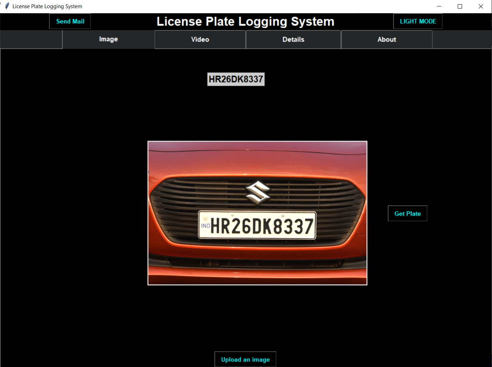

# Automatic-Number-Plate-Recognition

This project is to detect and recognize the Indian License plate in images.

  

### Technologies
This project is created with 
* python 3.7

### SETUP
To run this project install the requirements from the requirements.txt file.

Then run main.py file

### DATASET
We created our own dataset by capturing images of vechiles in differnt viewpoint and lighting condition. We collected about over 2000 images.
Then these images has been augumented.

Then all these images are manually annotated.

### MODULES
#### Plate detection
YOLOv3 is used to detect and segment the number plate in the images. The YOLOv3 model is trained with over 3000 images in google colab.

#### Preprocessing
The segmented plate will be preprocessed using OpenCV

#### Character detection
Another YOLOv3 model is used to detect the character in the preprocessed image which has been trained by annotating the segmented images.

#### Character Classification
Finally the LeNet architecture is used to classify the letter and numbers in the image.

